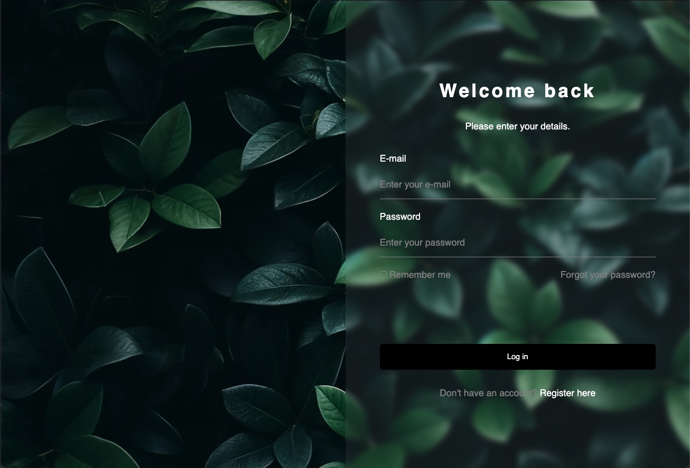

# Intégration de l'effet Glassmorphism en CSS



## Introduction

L'effet Glassmorphism est une tendance de design moderne qui donne aux éléments une apparence de verre givré. Cet effet est obtenu en combinant le flou, la transparence et les ombres. Ce README vous guidera à travers les étapes nécessaires pour intégrer l'effet Glassmorphism dans vos projets CSS.

## Prérequis

- Un éditeur de texte (comme VS Code, Sublime Text, etc.)
- Connaissance de base en HTML et CSS

## Étapes pour Intégrer l'Effet Glassmorphism

### 1. Créez le Fichier HTML de Base

Commencez par créer un fichier HTML de base qui contiendra l'élément sur lequel nous allons appliquer l'effet Glassmorphism.

```html
<!DOCTYPE html>
<html lang="en">
<head>
    <meta charset="UTF-8">
    <meta name="viewport" content="width=device-width, initial-scale=1.0">
    <title>Glassmorphism Example</title>
    <link rel="stylesheet" href="styles.css">
</head>
<body>
    <div class="glassmorphism">
        <h1>Glassmorphism Effect</h1>
        <p>This is an example of a glassmorphism effect in CSS.</p>
    </div>
</body>
</html>
```

### 2. Ajoutez les Styles CSS

Ensuite, créez un fichier CSS (`styles.css`) et ajoutez-y les styles nécessaires pour créer l'effet Glassmorphism.

```css
body {
    margin: 0;
    height: 100vh;
    display: flex;
    justify-content: center;
    align-items: center;
    background: url('background.jpg') no-repeat center center/cover;
    font-family: Arial, sans-serif;
}

.glassmorphism {
    width: 300px;
    padding: 20px;
    background: rgba(255, 255, 255, 0.1);
    border-radius: 10px;
    box-shadow: 0 4px 6px rgba(0, 0, 0, 0.1);
    backdrop-filter: blur(10px);
    border: 1px solid rgba(255, 255, 255, 0.18);
    text-align: center;
    color: #fff;
}

.glassmorphism h1 {
    margin-bottom: 15px;
}

.glassmorphism p {
    margin: 0;
}
```

### 3. Explication des Propriétés CSS Utilisées

- **`background: rgba(255, 255, 255, 0.1);`** : Définit un fond semi-transparent.
- **`border-radius: 10px;`** : Arrondit les coins de l'élément.
- **`box-shadow: 0 4px 6px rgba(0, 0, 0, 0.1);`** : Ajoute une ombre légère pour donner de la profondeur.
- **`backdrop-filter: blur(10px);`** : Applique un effet de flou à l'arrière-plan de l'élément.
- **`border: 1px solid rgba(255, 255, 255, 0.18);`** : Ajoute une bordure légèrement visible pour renforcer l'effet de verre.

### 4. Testez Votre Intégration

Ouvrez votre fichier HTML dans un navigateur pour voir le résultat. Vous devriez voir un élément avec un effet de verre givré (Glassmorphism).

## Conclusion

Vous avez maintenant intégré avec succès l'effet Glassmorphism en CSS. N'hésitez pas à expérimenter avec les valeurs de `rgba` et `blur` pour obtenir l'effet souhaité. Cet effet peut être utilisé pour créer des interfaces utilisateur modernes et élégantes.

Pour toute question ou suggestion, n'hésitez pas à ouvrir une issue ou à contribuer à ce projet.
