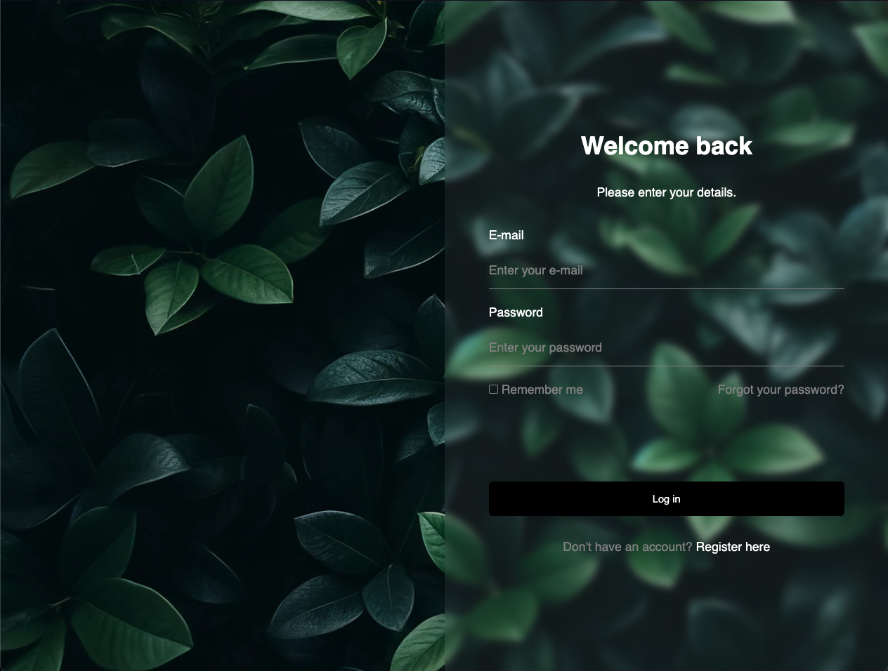

# Integrating the Glassmorphism Effect in CSS



## Introduction

The Glassmorphism effect is a modern design trend that gives elements a frosted glass appearance. This effect is achieved by combining blur, transparency, and shadows. This document highlights the key CSS properties used to create this effect in a project.

## Key Properties Used

### 1. `backdrop-filter`

- **Usage**: Apply background blur.
- **Property**: `backdrop-filter: blur(5px);`
- **Description**: The `backdrop-filter` property allows you to apply graphical effects such as blurring or color shifting to the area behind an element.

### 2. `background-color` with transparency

- **Usage**: Create a semi-transparent background.
- **Property**: `background-color: rgba(255, 255, 255, 0.06);`
- **Description**: Using `rgba` allows you to set a background color with transparency, enhancing the frosted glass effect.

### 3. `box-shadow`

- **Usage**: Add depth and a subtle blur effect around the element.
- **Property**: `box-shadow: 0 4px 6px rgba(0, 0, 0, 0.1);`
- **Description**: The `box-shadow` property creates shadows around elements to give a sense of depth.

### 4. `border`

- **Usage**: Define subtle borders around the element.
- **Property**: `border: 1px solid rgba(255, 255, 255, 0.18);`
- **Description**: Adding a border with low opacity reinforces the glass-like effect.

## Implementation Example

```css
.form-section {
  width: 100%;
  height: 100vh;
  display: flex;
  flex-direction: column;
  justify-content: center;
  align-items: center;
  background-color: rgba(255, 255, 255, 0.06);
  backdrop-filter: blur(5px);
  box-shadow: 0 4px 6px rgba(0, 0, 0, 0.1);
  border: 1px solid rgba(255, 255, 255, 0.18);
}
```

## Conclusion

These CSS properties are essential for achieving the Glassmorphism effect, providing a modern and elegant look to your web elements. By combining blur, transparency, and shadows, you can create attractive and dynamic user interfaces.

For any questions or suggestions, feel free to open an issue 😉
